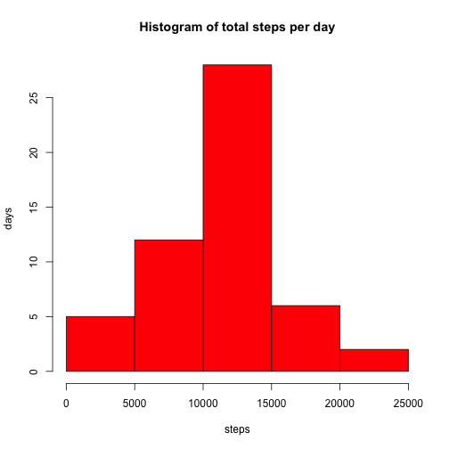
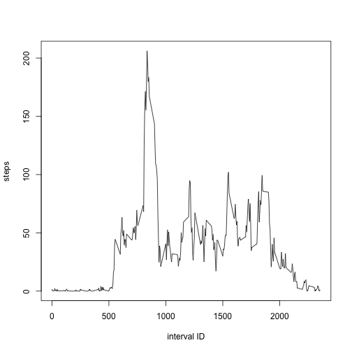
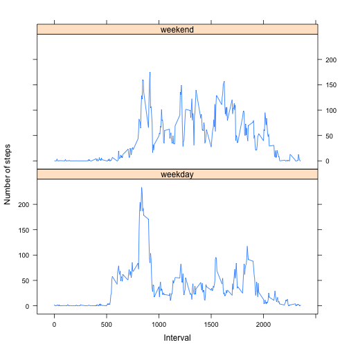

##Introduction

It is now possible to collect a large amount of data about personal movement using activity monitoring devices such as a Fitbit, Nike Fuelband, or Jawbone Up. These type of devices are part of the “quantified self” movement – a group of enthusiasts who take measurements about themselves regularly to improve their health; to find patterns in their behavior, or because they are tech geeks. But these data remain under-utilized both because the raw data are hard to obtain and there is a lack of statistical methods and software for processing and interpreting the data.


This assignment makes use of data from a personal activity monitoring device. This device collects data at 5:00 minute intervals through out the day. The data consists of two months of data from an anonymous individual collected during the months of October and November, 2012 and include the number of steps taken in 5 minute intervals each day.

##Loading and preprocessing the data
Read data into R: 

```r
wristband <- read.csv('activity.csv', header = TRUE, sep = ",",
                  colClasses=c("numeric", "character", "numeric"))
head(wristband)
```

```
##   steps       date interval
## 1    NA 2012-10-01        0
## 2    NA 2012-10-01        5
## 3    NA 2012-10-01       10
## 4    NA 2012-10-01       15
## 5    NA 2012-10-01       20
## 6    NA 2012-10-01       25
```
Process data:

```r
wristband$date <- as.Date(wristband$date, format = "%Y-%m-%d")
```
Show data:

```r
str(wristband)
```

```
## 'data.frame':	17568 obs. of  3 variables:
##  $ steps   : num  NA NA NA NA NA NA NA NA NA NA ...
##  $ date    : Date, format: "2012-10-01" "2012-10-01" ...
##  $ interval: num  0 5 10 15 20 25 30 35 40 45 ...
```
##What is mean total number of steps taken per day?

```r
steps_per_day <- aggregate(steps ~ date, wristband, sum)
colnames(steps_per_day) <- c("date","steps")
head(steps_per_day)
```

```
##         date steps
## 1 2012-10-02   126
## 2 2012-10-03 11352
## 3 2012-10-04 12116
## 4 2012-10-05 13294
## 5 2012-10-06 15420
## 6 2012-10-07 11015
```

```r
hist(steps_per_day$steps, main = "Histogram of total steps per day", xlab = "steps",ylab="days", freq=TRUE, col = "red")
```

 

Calculate and report the mean and median of the total number of steps taken per day

```r
mean(steps_per_day$steps, na.rm=TRUE)
```

```
## [1] 10766.19
```

```r
median(steps_per_day$steps, na.rm=TRUE)
```

```
## [1] 10765
```

##What is the average daily activity pattern?

```r
avg.steps.on.interval<-tapply(wristband$steps,wristband$interval,"mean",na.rm=TRUE) 
plot(names(avg.steps.on.interval),avg.steps.on.interval, xlab="interval ID",ylab="steps", type="l")
```

 

Which 5-minute interval, on average across all the days in the dataset, contains the maximum number of steps? see below calculation

```r
which.max(avg.steps.on.interval)
```

```
## 835 
## 104
```
##Imputing missing values
The missing values are summarized as:

```r
sum(is.na(wristband$steps))
```

```
## [1] 2304
```

fill missing values with mean:

```r
wristbandfill<-wristband
wristbandfill$steps[is.na(wristband$steps)]<-avg.steps.on.interval[is.na(wristband$steps)]
head(wristbandfill)
```

```
##       steps       date interval
## 1 1.7169811 2012-10-01        0
## 2 0.3396226 2012-10-01        5
## 3 0.1320755 2012-10-01       10
## 4 0.1509434 2012-10-01       15
## 5 0.0754717 2012-10-01       20
## 6 2.0943396 2012-10-01       25
```
histogram plot of new data:

```r
steps_per_day2 <- aggregate(steps ~ date, wristbandfill, sum)
colnames(steps_per_day2) <- c("date","steps")
hist(steps_per_day2$steps, main = "Histogram of total steps per day", xlab = "steps",ylab="days", freq=TRUE, col = "red")
```

 

mean and median of new data:

```r
mean(steps_per_day2$steps, na.rm=TRUE)
```

```
## [1] 10766.19
```

```r
median(steps_per_day2$steps, na.rm=TRUE)
```

```
## [1] 10765.59
```
mean is not affected since we use the mean to fill this slot and calculate mean again. median is affected

##Are there differences in activity patterns between weekdays and weekends?
A new factor variable is created: 

```r
wristband7<-wristbandfill
wristband7$weektime <- as.factor(ifelse(weekdays(wristband$date) %in% 
                        c("Saturday","Sunday"),"weekend", "weekday"))
summary(wristband7)
```

```
##      steps             date               interval         weektime    
##  Min.   :  0.00   Min.   :2012-10-01   Min.   :   0.0   weekday:12960  
##  1st Qu.:  0.00   1st Qu.:2012-10-16   1st Qu.: 588.8   weekend: 4608  
##  Median :  0.00   Median :2012-10-31   Median :1177.5                  
##  Mean   : 37.38   Mean   :2012-10-31   Mean   :1177.5                  
##  3rd Qu.: 15.00   3rd Qu.:2012-11-15   3rd Qu.:1766.2                  
##  Max.   :806.00   Max.   :2012-11-30   Max.   :2355.0                  
##  NA's   :2016
```
plot:

```r
StepsByWeektime <- aggregate(steps ~ interval + weektime, data = wristband7, mean)
names(StepsByWeektime) <- c("interval", "weektime", "steps")
#StepsByWeektime$interval <- as.numeric(levels(StepsByWeektime$interval))[StepsByWeektime$interval]
library(lattice)
xyplot(steps ~ interval | weektime, StepsByWeektime,  type = "l", layout = c(1, 2), 
        xlab = "Interval", ylab = "Number of steps")
```

 

There is obviouse difference between weekdays and weekends. It appears this user gets up later/goes to bed later during weekends, he/she is also more active during those weekend daytimes.
